# CS-12: Wi-Fi Security Assessment

**3MTT NextGen Cohort — Cybersecurity Track | Capstone Project**

**Fellow:** Abdulqoreeb Shakirullahi
**Fellow ID:** FE/26/6589115540
**Brief ID:** CS-12
**Track:** Cybersecurity

A complete Wi-Fi security assessment performed entirely on Android — using Termux + Nmap and a WiFi Analyzer app — no PC or external adapter required.

---

## Problem Context

Home and office Wi-Fi networks in Nigeria are frequently left with weak security configurations — default or simple passwords, outdated encryption protocols, and unnecessarily exposed device ports. This project assesses a self-owned, isolated test network to identify these weaknesses and produce concrete remediation guidance.

> ⚠️ **Scope note:** All testing in this project was performed exclusively against a personal mobile hotspot ("test") created and controlled by the author. No third-party, live, or unauthorized network was accessed or scanned at any point, in line with the brief's safe-lab requirement.

---

## Tools Used

| Tool | Purpose | Platform |
|---|---|---|
| Termux | Terminal emulator for running Linux packages on Android | Android |
| Nmap 7.99 | Host discovery and port scanning | Termux (Android) |
| WiFi Analyzer | Encryption type, signal strength, channel, and band inspection | Android app |

Nmap is one of the tools officially suggested in the CS-12 brief. This project uses it directly via Termux to keep the entire assessment mobile-only.

---

## Lab Setup

A mobile hotspot named **"test"** was created and used as the test network throughout the assessment, with a second device connected to it as a client.

### Step 1 — Create the Test Network
The hotspot was configured with the network name `test`, WPA2-Personal security, and the 5 GHz AP band.

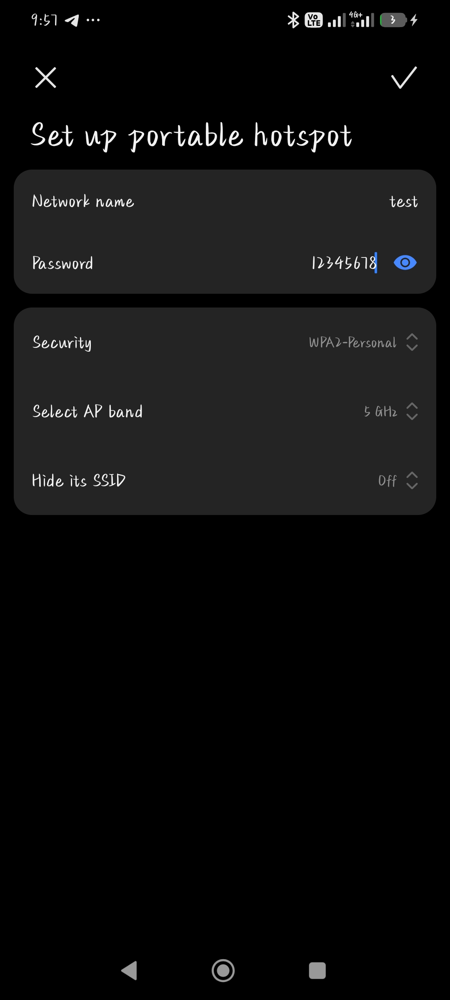

### Step 2 — Connect the Client Device
A second device was connected to the `test` network.

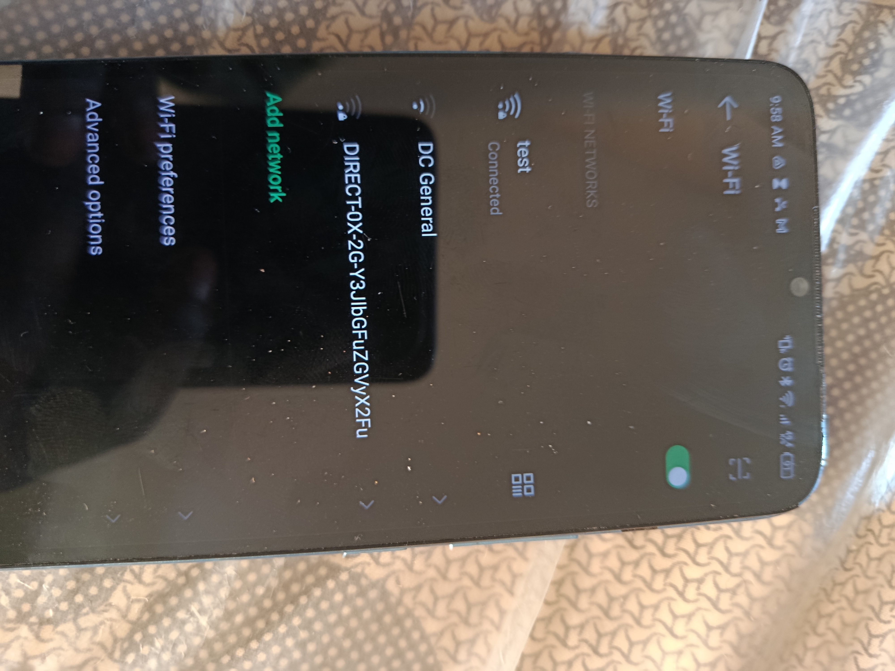

### Step 3 — Install Termux
Termux (v0.119.0-beta.3) was installed via F-Droid.

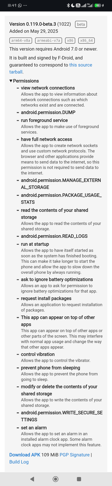
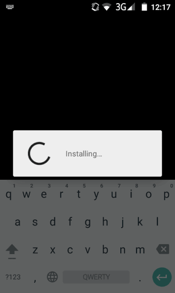

### Step 4 — Update Packages and Install Nmap
```bash
pkg update
pkg install nmap
```
The first `pkg update` attempt failed to reach a mirror; a second attempt succeeded.

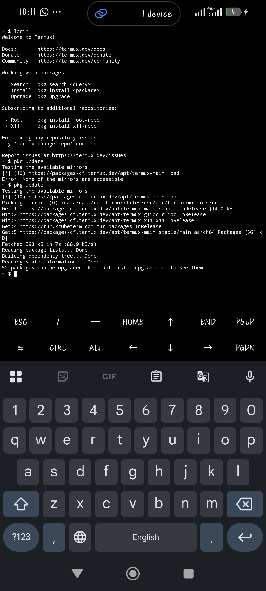
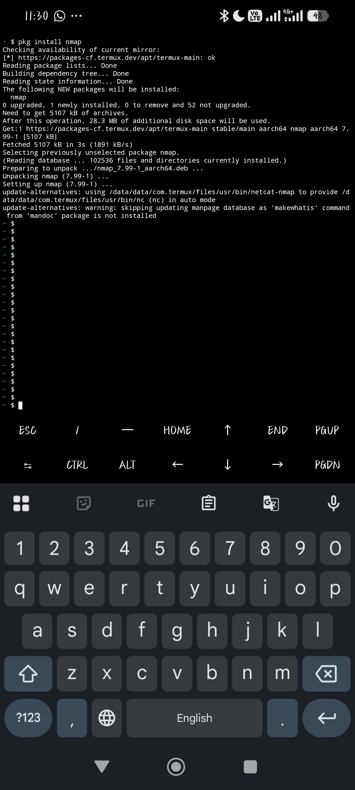

Nmap 7.99-1 installed successfully.

---

## Assessment Procedure & Results

### 1. Network Address

The connected device's network details were checked directly from Android's WiFi settings:

| Field | Value |
|---|---|
| IP address (connected device) | 10.248.253.121 |
| Gateway (hotspot host) | 10.248.253.13 |
| Subnet mask | 255.255.255.0 |
| Transmit link speed | 390 Mbps |
| Receive link speed | 433 Mbps |

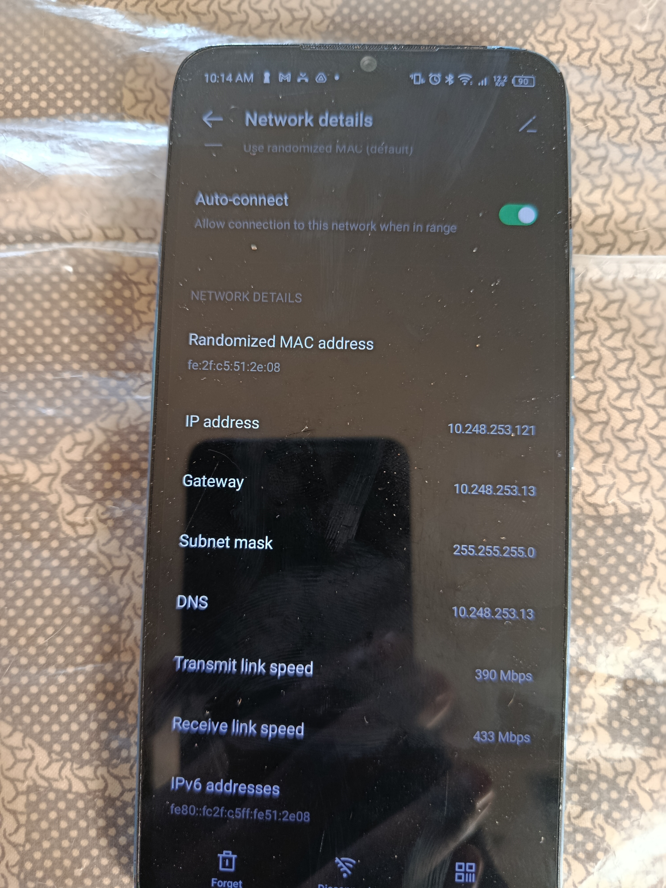

### 2. Host Discovery

```bash
nmap -sn 10.248.253.13/24
```
```
Nmap scan report for 10.248.253.13
Host is up (0.0016s latency).
Nmap scan report for 10.248.253.121
Host is up (0.051s latency).
Nmap done: 256 IP addresses (2 hosts up) scanned in 4.29 seconds
```
**Two hosts identified:** `.13` (hotspot gateway) and `.121` (connected client device).

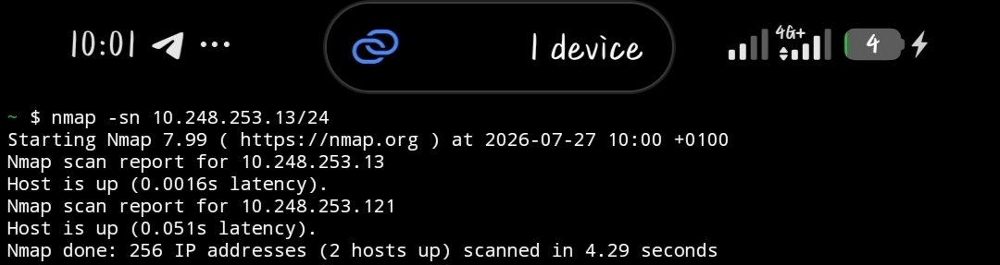

### 3. Port Scan

```bash
nmap 10.248.253.13
```
```
Not shown: 999 closed tcp ports (conn-refused)
PORT   STATE SERVICE
53/tcp open  domain
Nmap done: 1 IP address (1 host up) scanned in 2.09 seconds
```
**One open port found: 53/tcp (DNS).** All other 999 scanned ports were closed. Port 53 being open is normal and low-risk — commonly associated with DNS resolution services running on the device.

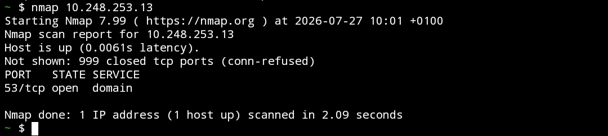

### 4. WiFi Security Details

Checked using WiFi Analyzer on the connected device:

| Field | Value |
|---|---|
| Network | test |
| Security | WPA2 |
| Signal strength | -41 dBm |
| Channel | 149 (155) |
| Frequency | 5745 MHz, 80 MHz width |
| Standard | WiFi 5 |
| Link speed | 390 Mbps |

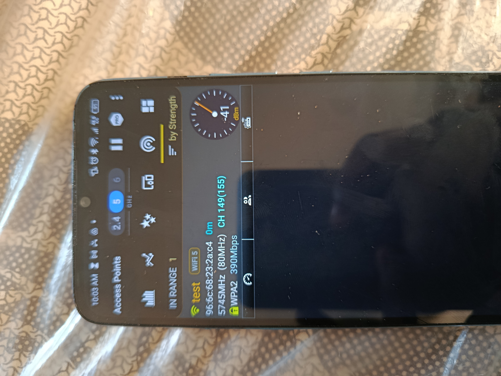

A signal strength of -41 dBm is a strong reading, indicating the two devices were in close proximity with minimal signal loss.

### 5. Password Strength Comparison

| Test | Password | Result |
|---|---|---|
| Weak | `12345678` | Accepted by Android with no warning or restriction, despite being one of the most common and easily guessed passwords in use |
| Strong | `w_LwIMrsJ!!EI3U` | Also accepted, with no functional difference in the setup process — Android does not enforce or reward stronger password choices |


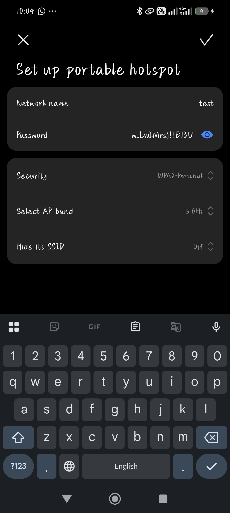

---

## Findings

| # | Finding | Risk | Recommendation |
|---|---|---|---|
| 1 | Network used WPA2, not WPA3 | WPA2 is more susceptible to offline dictionary attacks than WPA3 | Enable WPA3 if device hardware supports it |
| 2 | Weak password (`12345678`) accepted without any restriction or warning | Trivially guessable/crackable — offers minimal real protection | Manually enforce strong passwords (12+ characters, mixed case, numbers, symbols); do not rely on the OS to catch weak choices |
| 3 | One open port (53/DNS) on the connected device; all other 999 scanned ports closed | Low — DNS is a routine, expected service | No action needed; periodic re-scanning recommended to catch any future unexpected changes |
| 4 | Signal strength measured at -41 dBm | Not a risk — strong signal, close-range test setup | N/A |

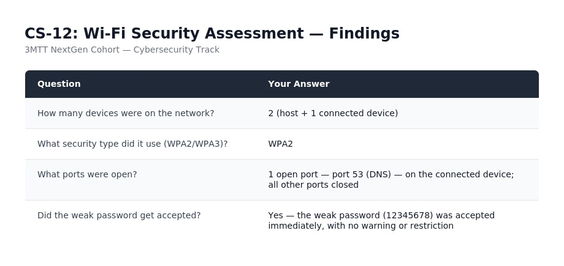

---

## Interpreting the Results

WPA2 remains reasonably secure for most users, especially combined with a strong password — but WPA3 is preferable where supported, since it offers stronger protection against offline password-guessing attacks. An open port isn't automatically dangerous; the real question is always whether the service behind it is actually needed. In this case, only DNS (port 53) was found open, a routine and low-risk service. The clearest weakness found wasn't technical at all — it was that Android accepted a weak, common password with no warning, leaving password strength entirely up to the user's judgment.

---

## Recommendations

1. **Use WPA3 where supported.**
2. **Choose strong passwords manually** — 12+ characters, mixed case, numbers, symbols. Don't rely on the OS to enforce this.
3. **Review connected devices periodically**; disconnect and change the password if an unfamiliar device appears.
4. **Turn off the hotspot when not in active use.**
5. **Keep devices updated** with the latest security patches.

---

## Ethical Use Statement

This assessment was conducted entirely on a personal mobile hotspot owned and controlled by the author, in an isolated lab environment, in accordance with the 3MTT NextGen Cybersecurity track's safe-lab requirement. No unauthorized, third-party, or public network was accessed or scanned at any point.

---

## References

- Nmap Documentation: https://nmap.org/docs.html
- Termux Documentation: https://termux.dev/

## License

Released under the **MIT License** — free to use, modify, and share for educational purposes.
