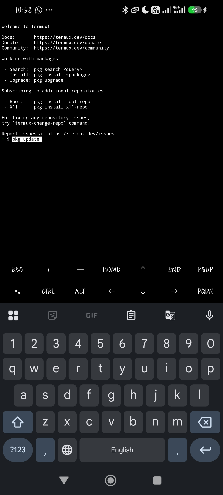

# CS-12: Wi-Fi Security Assessment

**3MTT NextGen Cohort — Cybersecurity Track | Capstone Project**

A mobile-only Wi-Fi security assessment lab, built entirely on Android using Termux + Nmap and WiFi Analyzer — no PC required.

*Wani gwajin tsaron Wi-Fi da aka gina gaba daya da waya (Android) ta amfani da Termux + Nmap da WiFi Analyzer — babu bukatar kwamfuta.*

---

## Problem Context / Asalin Matsalar

**EN:** Home and office Wi-Fi networks in Nigeria are frequently left with weak security configurations — default or simple passwords, outdated encryption protocols, and unnecessarily exposed device ports. This project assesses a self-owned, isolated test network to identify these weaknesses and produce concrete remediation guidance.

**HA:** A yawancin gida da ofis a Najeriya, Wi-Fi din su ba shi da kariya sosai — password mai sauƙi, tsohon encryption, da ports da aka bari a bude ba tare da bukata ba. Wannan project zai duba wani network na kanmu (namu) domin gano wadannan raunin tsaro da bayar da shawarwarin gyara.

> ⚠️ **Scope note / Bayanin iyaka:** All testing in this project was performed exclusively against a personal mobile hotspot created and controlled by the author. No third-party, live, or unauthorized network was accessed or scanned at any point, in line with the brief's safe-lab requirement.
>
> *Duk gwajin da aka yi a wannan project an yi shi ne kawai akan hotspot na kansa (wanda marubucin ya kirkira kuma yake sarrafawa). Ba a taba wani network na wani mutum ba, ko live network, a ko'ina cikin wannan aiki — daidai da bukatar "safe-lab" da aka bayar a brief din.*

---

## Tools Used / Kayan Aikin da Aka Yi Amfani da Su

| Tool | Purpose (EN) | Manufa (HA) | Platform |
|---|---|---|---|
| Termux | Terminal emulator for running Linux packages on Android | App din da ke baka damar rubuta commands kamar kwamfuta, a waya | Android |
| Nmap | Host discovery and port scanning | Domin gano na'urori a network da kuma duba open ports | Termux (Android) |
| WiFi Analyzer | Encryption type, signal strength, channel inspection | Domin duba irin security (WPA2/WPA3), karfin signal, da channel | Android app |

**EN:** Both Nmap and Wireshark-equivalent packet inspection are listed as suggested tools in the official CS-12 brief; this project uses Nmap directly via Termux to keep the assessment fully mobile.

**HA:** Nmap yana daya daga cikin tools da aka bada shawara a hukumance a brief din CS-12; wannan project ya yi amfani da Nmap ta hanyar Termux domin a rike duk aikin a waya kadai.

---

## Lab Setup / Kafa Gwajin

### Step 1 — Create the Test Network / Kafa Network din Gwaji
**EN:** A personal mobile hotspot was created on the primary test device (Redmi Note 14) to serve as the isolated network under assessment.

**HA:** An kafa hotspot na kansa akan babbar na'urar gwaji (Redmi Note 14) domin ya zama network din da za a duba.

`[screenshot: hotspot settings screen]`

### Step 2 — Install Termux / Shigar da Termux
**EN:** Termux was installed via F-Droid to ensure package compatibility (the Play Store build is deprecated for package management).

**HA:** An shigar da Termux ta hanyar F-Droid domin tabbatar da cewa packages za su yi aiki yadda ya kamata (ba a bada shawarar amfani da Play Store version ba yanzu).

`[screenshot: F-Droid Termux page]`
`[screenshot: download in progress]`


### Step 3 — Update Packages / Sabunta Packages
```bash
pkg update
```
`[screenshot: pkg update output]`

### Step 4 — Install Nmap / Shigar da Nmap
```bash
pkg install nmap
```
`[screenshot: pkg install nmap output]`

---

## Assessment Procedure / Yadda Aka Gudanar da Gwajin

### 1. Host Discovery / Gano Na'urori a Network
**EN:** Identify active devices on the test network:
**HA:** Gano na'urorin da suke aiki a cikin network din gwaji:
```bash
nmap -sn 192.168.43.0/24
```
`[screenshot: host discovery results]`

### 2. Port Scan / Duba Open Ports
**EN:** Scan the identified host(s) for open ports:
**HA:** Yi scan akan na'urar/na'urorin da aka gano domin duba open ports:
```bash
nmap 192.168.43.1
```
`[screenshot: port scan results]`

### 3. Encryption & Signal Assessment / Duba Encryption da Signal
**EN:** Using WiFi Analyzer, the test network was inspected for:
- Security protocol (WPA2 / WPA3 / Open)
- Signal strength
- Channel

**HA:** Ta amfani da WiFi Analyzer, an duba network din gwaji domin:
- Irin security (WPA2 / WPA3 / Open)
- Karfin signal
- Channel da ake amfani da shi

`[screenshot: WiFi Analyzer results]`

### 4. Password Strength Comparison / Kwatanta Karfin Password
**EN:** Two configurations were tested for comparison:
**HA:** An gwada saitunan guda biyu domin kwatantawa:

| Test / Gwaji | Password | Observation / Abin da Aka Gani |
|---|---|---|
| Weak config / Password mai sauƙi | `12345678` | *(fill in observed result / a rubuta abin da aka gani)* |
| Strong config / Password mai karfi | *(strong password used / password mai karfi da aka yi amfani da shi)* | *(fill in observed result / a rubuta abin da aka gani)* |

`[screenshot: weak password test]`
`[screenshot: strong password test]`

---

## Findings / Abubuwan da Aka Gano

*(Fill in based on actual results — example structure below / A rubuta bisa ga sakamakon ainihi — ga misalin tsari a kasa)*

| # | Finding (EN) | Abin da Aka Gano (HA) | Risk / Hadari | Recommendation / Shawara |
|---|---|---|---|---|
| 1 | Network used WPA2 rather than WPA3 | Network ya yi amfani da WPA2 maimakon WPA3 | WPA2 is more susceptible to offline dictionary attacks than WPA3 / WPA2 yana da rauni fiye da WPA3 wajen kariya daga hare-haren tsinkayar password | Enable WPA3 if hardware supports it / A canza zuwa WPA3 in na'urar ta goyi baya |
| 2 | Weak password (`12345678`) accepted without restriction | An yarda a yi amfani da password mai sauƙi (`12345678`) ba tare da wata takura ba | Trivially guessable/crackable / Ana iya tsinkayar wannan password cikin sauƙi | Enforce minimum password length + complexity / A tilasta tsawon password da hadewar haruffa/lambobi/alamomi |
| 3 | *(port(s) found open)* | *(port(s) da aka gano a bude)* | *(what this exposes / abin da wannan ke bijiro da shi)* | *(fix — disable unused services, restrict access / gyara — a rufe services da ba a bukata, a takura shiga)* |

---

## Remediation Summary / Takaitaccen Shawarwari

**EN:**
- Use WPA3 encryption where device/router support allows.
- Enforce strong passwords: minimum 12 characters, mixed case, numbers, symbols.
- Disable unused open ports/services on connected devices.
- Regularly review connected devices on the network for unrecognized entries.

**HA:**
- A yi amfani da WPA3 in na'ura/router ya goyi baya.
- A tilasta password mai karfi: akalla haruffa 12, cakuda manya da kanana, lambobi, da alamomi.
- A rufe ports/services da ba a bukata a na'urorin da ke haɗe da network.
- A rika duba na'urorin da ke haɗe da network akai-akai domin gano duk wani baƙon na'ura.

---

## Demo Video / Bidiyon Bayani

A 2–3 minute walkthrough explaining the setup, findings, and recommendations in the author's own words:

*Bidiyo na minti 2-3 wanda marubucin ya bayyana yadda aka kafa gwajin, abin da aka gano, da shawarwari, da kansa:*

**[link to video / link din bidiyo]**

---

## Disclaimer / Sanarwa

**EN:** This assessment was conducted entirely on infrastructure owned and controlled by the author, in an isolated lab environment, in accordance with the 3MTT NextGen Cybersecurity track's safe-lab requirement. No unauthorized or third-party systems were accessed.

**HA:** An gudanar da wannan gwajin gaba daya akan kayan aikin da marubucin ke da shi kuma yake sarrafawa, a cikin wani lab da aka keɓe shi, daidai da bukatar "safe-lab" na 3MTT NextGen Cybersecurity track. Ba a taba wani na'ura ko network na wani mutum ba tare da izini ba.
